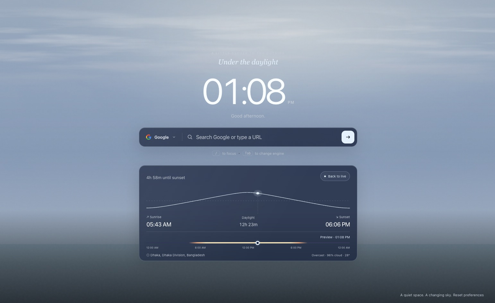
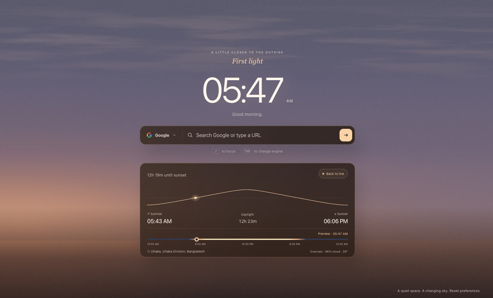
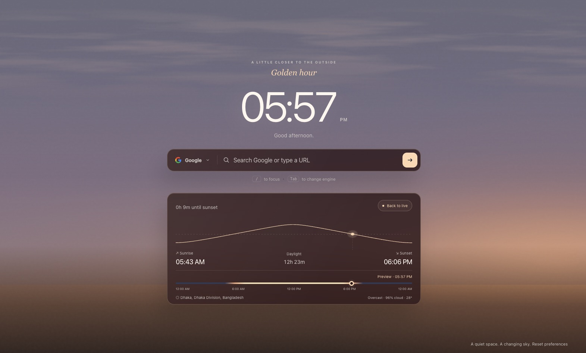
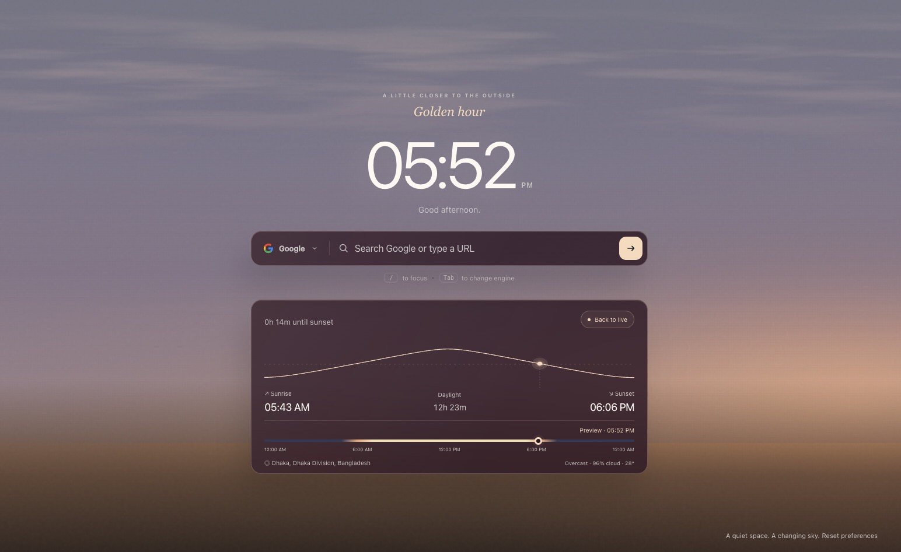
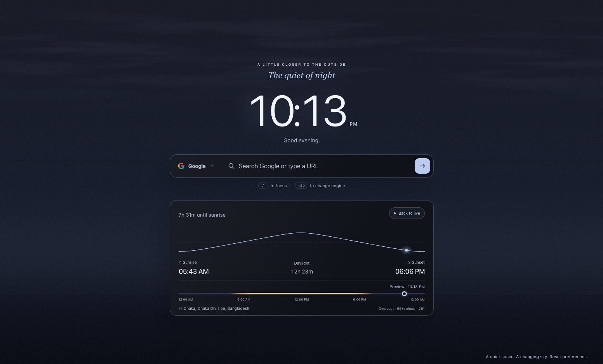

# Quiet New Tab

A Chrome extension that replaces your new tab page with a calm, minimal interface featuring a live solar sky, real-time clock, and a clean search bar.

 

## Screenshots

### ☀️ Daytime — Clear blue sky with the sun overhead


### 🌅 Dawn — First light before sunrise


### 🌇 Golden Hour — Warm tones as the sun nears the horizon


### 🌆 Dusk — Last light after sunset


### 🌙 Night — Deep dark sky under the stars


## Features

- **Live Solar Sky** — A dynamically rendered sky that follows the real sun's position throughout the day, with accurate sunrise/sunset colors and transitions.
- **Real-Time Clock** — Large, readable clock with 12h/24h format toggle.
- **Search Bar** — Switchable search engine picker (Google and more) with keyboard shortcuts.
- **Sun Chart** — An interactive altitude chart showing the sun's path for the day, with sunrise, sunset, and daylight duration.
- **Time Explorer** — Scrub through the day with a timeline slider to preview the sky at any time.
- **Live Clouds** — Optional cloud layer drawn from real weather data via the [Open-Meteo API](https://open-meteo.com/).
- **Location Aware** — Search by city or use device geolocation for accurate sun positioning.
- **Personalized Greeting** — Set your name for a friendly welcome message.
- **Minimal & Private** — No tracking or analytics; city search and optional weather data come directly from Open-Meteo.

## Installation

1. Clone or download this repository.
2. Open `chrome://extensions` in Chrome.
3. Enable **Developer mode** (top-right toggle).
4. Click **Load unpacked** and select the project folder.
5. Open a new tab to see it in action.

## How to Use

1. **Open a new tab** — The extension automatically replaces Chrome's default new tab page with the live solar sky.
2. **Search the web** — Press `/` to focus the search bar, type your query, and hit `Enter`. Press `Tab` to cycle between search engines (Google, DuckDuckGo, etc.).
3. **Explore the sun chart** — The bottom panel shows the sun's altitude throughout the day, along with sunrise/sunset times and total daylight hours.
4. **Preview any time of day** — Drag the timeline slider in the sun chart to scrub through the day and watch the sky change in real time. Click **Back to live** to return to the current time.
5. **Customize your experience** — Click the ⚙️ settings button to:
   - Toggle 12h/24h clock format
   - Set your name for a personalized greeting
   - Choose your location source (city search or device location)
   - Enable/disable live cloud rendering
   - Adjust the sun's visual size

### Keyboard Shortcuts

| Shortcut | Action |
| -------- | --------------- |
| `/` | Focus search bar |
| `Tab` | Cycle search engine |
| ⚙️ button | Open settings |

### Settings

- **24-hour clock** — Switch between 12h and 24h format.
- **Open in a new tab** — Keep the new tab page open after searching.
- **Location source** — Search for a city or use your device location.
- **Live clouds** — Toggle real-time cloud rendering (uses Open-Meteo).
- **Sun display scale** — Adjust the sun's visual size.
- **Your name** — Personalize the greeting.

## Use Cases

- **🧘 Mindful browsing** — Replace the cluttered default new tab with a calming, distraction-free space that gently connects you to the natural rhythm of the day.
- **⏰ Time awareness** — Glance at a beautiful, always-accurate clock with a personalized greeting every time you open a new tab.
- **🌍 Remote workers & travelers** — Stay connected to local sunrise and sunset times by searching for a city.
- **📚 Students & focused work** — A minimal new tab with just a search bar — no news feeds, no trending articles, no distractions.
- **🎨 Aesthetic desktop** — Enjoy a live, ever-changing sky that transitions naturally through dawn, daylight, golden hour, dusk, and night.
- **☁️ Weather at a glance** — With live clouds enabled, get a subtle visual sense of current cloud cover without opening a weather app.
- **🔒 Privacy-first users** — No tracking or analytics. City searches and optional cloud requests use Open-Meteo; saved settings stay in browser storage.

## Project Structure

```
├── index.html          # Main new tab page
├── styles.css          # All styling
├── app.js              # Clock, search, settings, and UI logic
├── solar.js            # Sky rendering and sun visuals
├── solar-model.js      # Solar position calculations
├── weather.js          # Cloud cover data from Open-Meteo
├── vendor/
│   └── suncalc.js      # SunCalc library for astronomical calculations
├── tests/              # Test suite
└── manifest.json       # Chrome extension manifest (V3)
```

## Credits

- [SunCalc](https://github.com/mourner/suncalc) — Sun position and sunlight phase calculations.
- [Open-Meteo](https://open-meteo.com/) — Free weather API for cloud cover data.

## License

[MIT](LICENSE)
